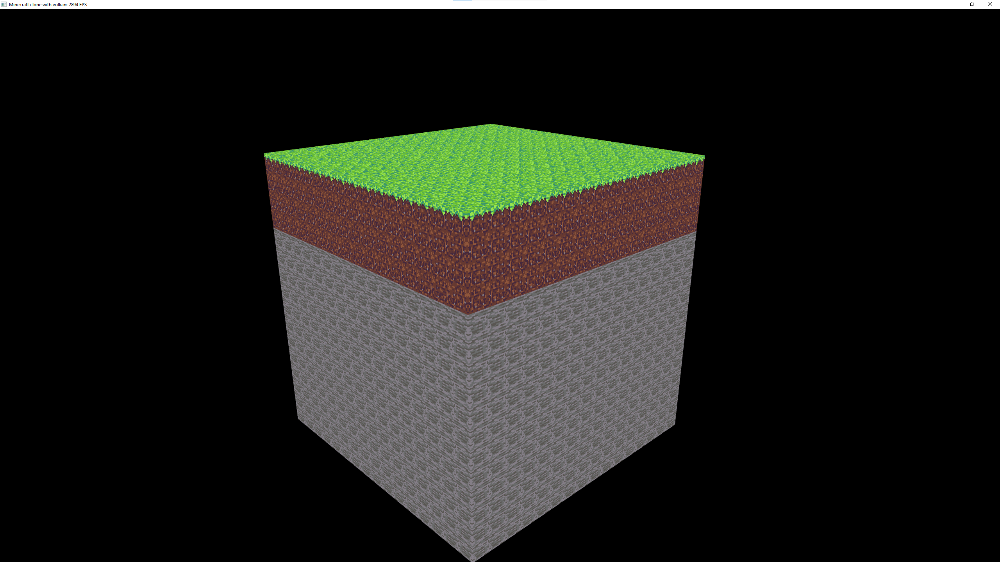

# Minecraft in C++, using Vulkan

2000 lines of vulkan boilerplate...

> Every self-respecting programmer must make a Minecraft clone in their lifetime.
> \- Me




## Build instructions


⚠ Only windows is supported! Furthermore, the build system supports only MSVC!  ⚠


I use [nob.c](https://github.com/tsoding/musializer/blob/master/nob.c) as my build system.
You need to have `cl.exe` and `glslc.exe` (google's glsl to SPIR-V compiler, https://github.com/google/shaderc) in your path


1. Compile the build system

```console
cl nob.c
````

2. Build the game and the assets

```console
nob.exe -release
```

The output is located in `run_tree`